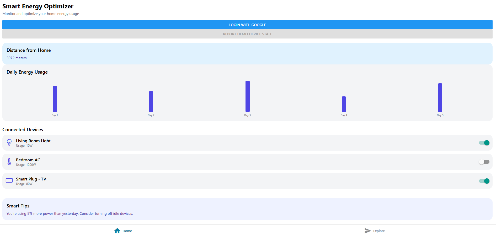

# ⚡ Smart Energy Optimizer

A cross-platform React Native application built for the **Google Home APIs Developer Challenge 2025**.  
It intelligently monitors, visualizes, and optimizes your smart home energy usage using Google OAuth, HomeGraph API, and geolocation-based automation.



---

## 🚀 Features

- 🔐 **Google Login Integration** using OAuth2 for secure authentication  
- 🏡 **Device Control via Google Home API** – toggle lights, ACs, smart plugs, etc.  
- 📊 **Energy Usage Visualization** with interactive daily usage bar charts  
- 📍 **Location-Aware Automation** – detects user’s distance from home and auto-turns off devices  
- 📡 **Real-time State Reporting** to Google Home using `reportStateAndNotification`  
- 🧠 **Smart Energy Tips** based on usage history and consumption trends  

---

## 🧱 Tech Stack

- **React Native** (UI & logic)  
- **Expo** (build & deploy)  
- **Google OAuth2** via `expo-auth-session`  
- **Google HomeGraph API**  
- **Geolocation** using `expo-location`  

---

## 📦 Installation

1. **Clone the Repository**

   ```bash
   git clone https://github.com:sairamireddy6/smart-energy-optimizer.git
   cd smart-energy-optimizer
